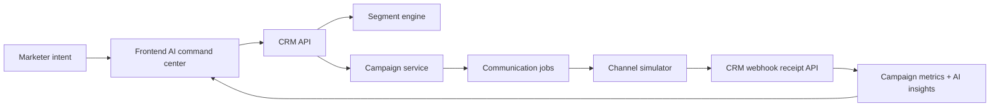

# Architecture

## Data Model

- Customer: name, email, phone, city, tags, total spent, total orders, inactive days, engagement score.
- Order: customer ID, total amount, status.
- Segment: name, rules, AI-generated flag.
- Campaign: segment rules, channel, message, status.
- Communication: campaign ID, customer ID, channel, status, events, retry count.

## Lifecycle

1. Campaign is created from segment rules.
2. CRM creates one communication per matched shopper.
3. CRM sends each communication to the simulator.
4. Simulator accepts the send and returns immediately.
5. Simulator asynchronously calls the CRM webhook with status events.
6. CRM stores the events and exposes campaign metrics.

## Production Upgrades

- Replace in-memory state with durable storage.
- Add authentication and brand-level tenancy.
- Add queue workers for campaign fanout.
- Add idempotency keys on callbacks.
- Add dead-letter queues and retry policies.
- Stream metric updates over WebSocket or Server-Sent Events.
- Use a real LLM only behind validated JSON schemas and guardrails.
